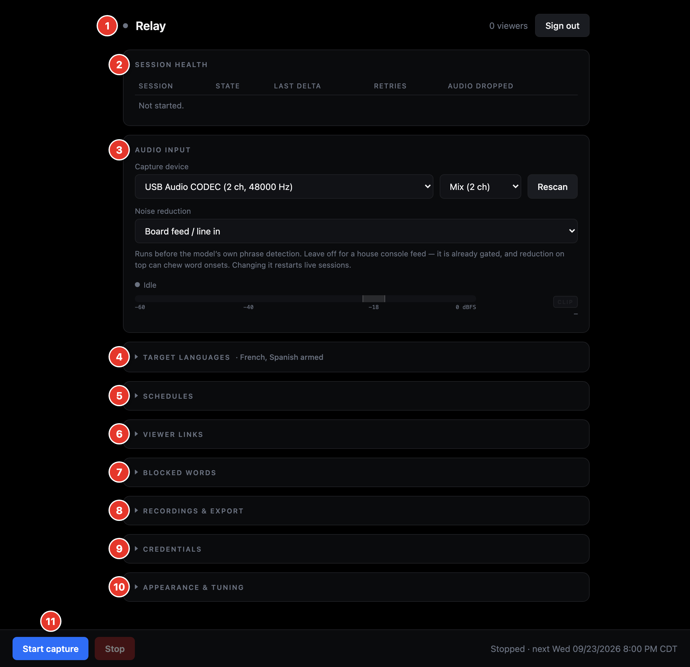

# Writing the Relay user guide

The guide is for operators who are not developers: people who set up the
machine at a venue, run a session and hand the link to the room. The README is
for engineers; this guide is for everyone else.

## Language

- Simple English. Short sentences, one idea per sentence, active voice:
  "Click **Start capture**", not "Capture may be started by…".
- Technical terms are fine (API key, Docker, HTTPS, certificate, LAN IP
  address, port, fingerprint). Explain each one briefly the first time it
  appears in a chapter, and add it to `src/90-glossary.md`.
- Number the steps. After each step, say what the reader should see: "The
  meter should move when someone speaks."
- Name buttons and labels exactly as they appear on screen, in bold:
  **Start capture**, **Save credentials**.
- Keys and typed text in code: `Return`, `./setup.sh`.

## Markup

Source is Pandoc Markdown, one file per chapter in `src/`, built in filename
order.

Callouts are fenced divs with one of three classes:

```markdown
::: note
Setup only runs once. Start runs every time.
:::

::: tip
Bookmark the panel address.
:::

::: warning
Never share your API key.
:::
```

Screenshots:

```markdown
{width=100%}
```

- Store them in `images/`, with descriptive kebab-case names
  (`admin-audio-input.png`, not `shot3.png`).
- Annotate with numbered callouts, then explain each number in a list below
  the image, in the same order.
- Take them from the current `main` build in rehearsal mode (`RELAY_DEMO=1`)
  or with test data. They must never show a real API key, admin token or
  private IP address. Addresses shown are examples.
- Relay screenshots are captured by `tools/capture.mjs`, so they can be
  retaken after a UI change with one command. See `README.md`.

Chapters start with a level-1 heading (`#`). Use `##` and `###` inside.
Parts are level-1 headings with the class `.part`:

```markdown
# Part 1: Web GUI reference {.part}
```
